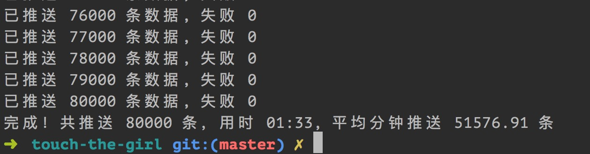

 ### 运行程序
 
 - `composer install`
 - 创建 config/accounts.php
 ```php
 <?php
 
 return [
     [
         'app_id' => 'fake_id',
         'secret' => 'fake_secret',
     ],
     [
         'app_id' => 'fake_id_2',
         'secret' => 'fake_secret_2',
     ]
 ];
 ```
  - 修改 config/template-message.php 以自定义消息内容
  - `chmod 777 log`
  - `php bin/main`
  
 ### 本地并发实验
 
 